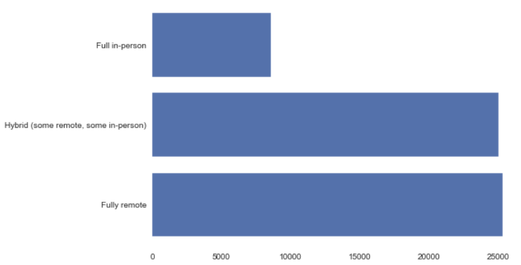
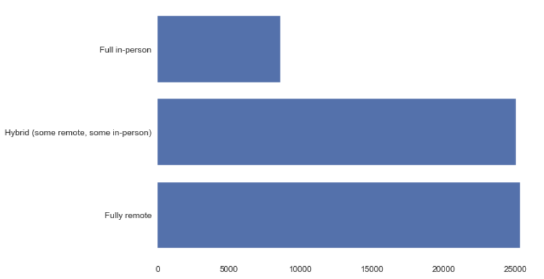
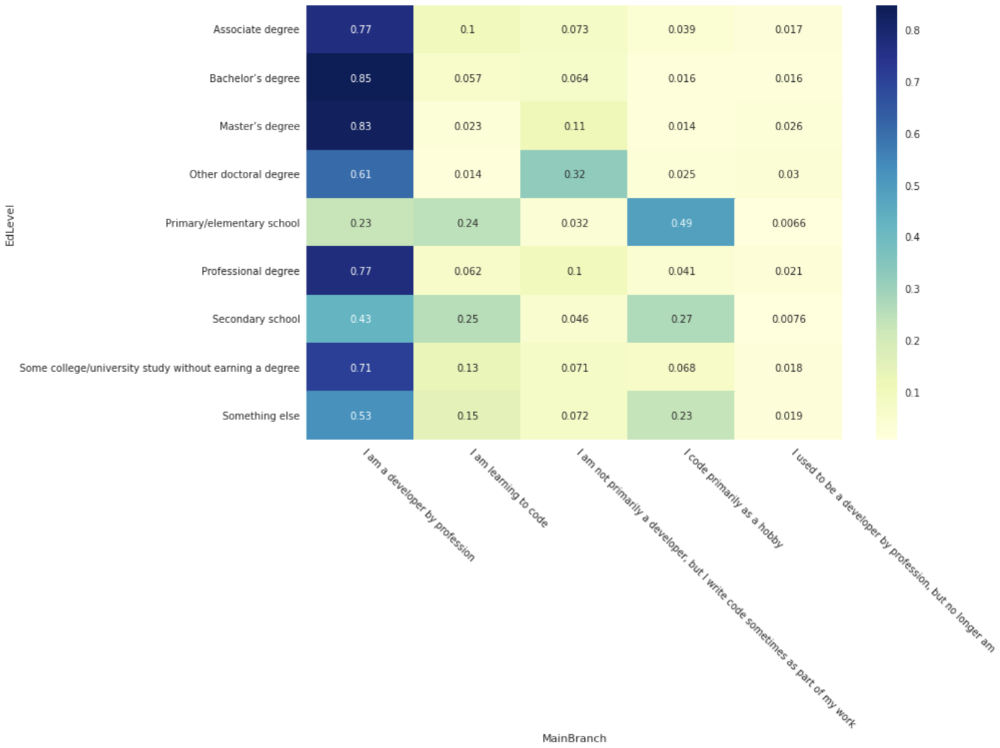
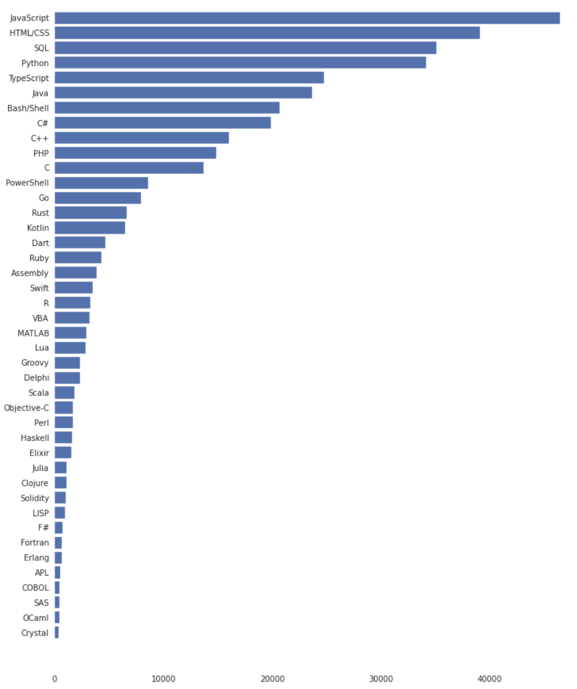

# Software Engineer in 2022

### Libraries used
- pandas
- numpy
- matplotlib
- seaborn as sns

### Motivation for the project
To explore the developer world.

### The files in the repository with a small description of each
- All code will be in <code>Analysis.ipynb</code>.
- Data folder to contain data schema and description from stackoverflow.

### Questions
- Developer profile
- Technology in 2022
- The relevant between 'DevType' and 'MainBrach'
- Work after covid

### Business Understanding
This repo is going to explore the developer world in:
- Developer profile
- Work after covid
- Technology in 2022

### Data Understanding
- Link to download the file: https://survey.stackoverflow.co/2022/
- This is the result in the survey from stackoverflow.
- Data types are string and number but the data we using in this analysis are Categorical variables

### Prepare Data
- We drop nan value because in the field that we dig deep into are not contain many nan value and there is no replace value that have meaning full for the data.

### Developer profile
- Analyse the Education Level

- Most of developer have at least a degree.

### Work after covid
- Analyse the RemoteWork

- After covid, people prefer to work remote more than full in-person.

### The relevant between 'DevType' and 'MainBrach'
- Using Chi-Square to should the relevant between 'DevType' and 'MainBrach'

- People most likely are professional developer when they have a bachelor degree.

### Technology in 2022
- Analyse LanguageHaveWorkedWith

- Most developer work with JavaScript because it's have many advantages including dynamic type, run browser and have many native module for mobile and desktop apps.

### Evaluation
The developer world have more quality developers and languages and tools.

